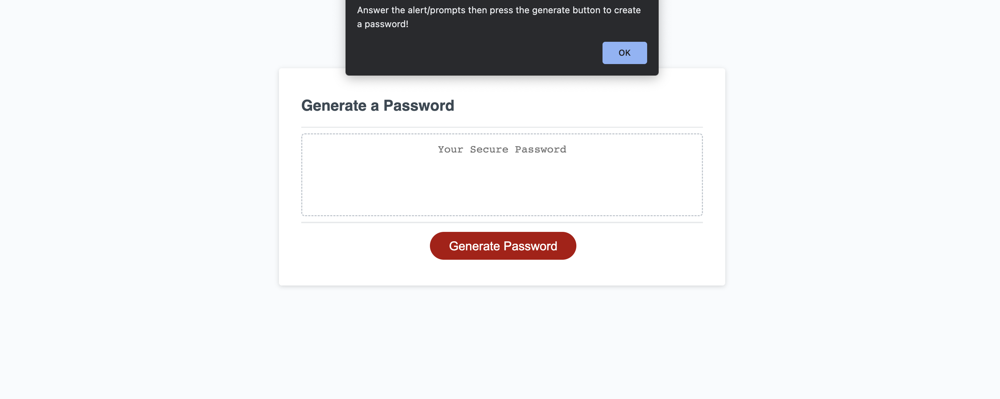

# Password Generator

## Overview

The Password Generator is a robust, user-friendly web application designed to create unique, strong, and secure passwords in a simple and intuitive manner. The interface is easy to navigate, and users are guided through the process of generating passwords with clear, step-by-step instructions.

- **Deployed application link:** [Open-Sesame](https://andrewtullos.github.io/Open-Sesame/)

## Key Features

- **User Prompts**: The application provides intuitive user prompts, ensuring that users know exactly what to do. Upon accessing the application, an initial alert informs users of the steps to follow.

- **Customizable Password Length**: Users can specify the desired password length, ensuring that the generated password aligns with any specific requirements they may have.

- **Instant Password Generation**: Users can quickly generate passwords by clicking the prominent "Generate Password" button. They can repeat this step as many times as they wish until they find a password that suits their needs.

- **Interactive User Experience**: The application is designed with a focus on user experience, offering a seamless and interactive process for password generation.

## Target Audience

The Password Generator is ideal for individuals who require a secure, unique password for various online accounts, including email, social media, banking, or e-commerce. It is also suitable for developers and IT professionals who need to generate strong passwords for system and application access.

## Technical Implementation

The Password Generator is developed with JavaScript and incorporates fundamental coding concepts such as if-else statements and functions. It also highlights the interplay between JavaScript and the HTML document. The user prompts are implemented using the JavaScript `prompt` method.

## Installation

To experience the full functionality of the Password Generator, it is recommended to use the [Chrome](https://www.google.com/chrome/) browser. No additional installation is required.

## Credits

This application was made possible with the assistance of various online resources. One such resource is the tutorial on prompts from [W3Schools](https://www.w3schools.com/jsref/tryit.asp?filename=tryjsref_prompt).

## License

Please note that this application is intended for demonstration purposes and does not come with a license. The code is provided as-is for educational purposes.
